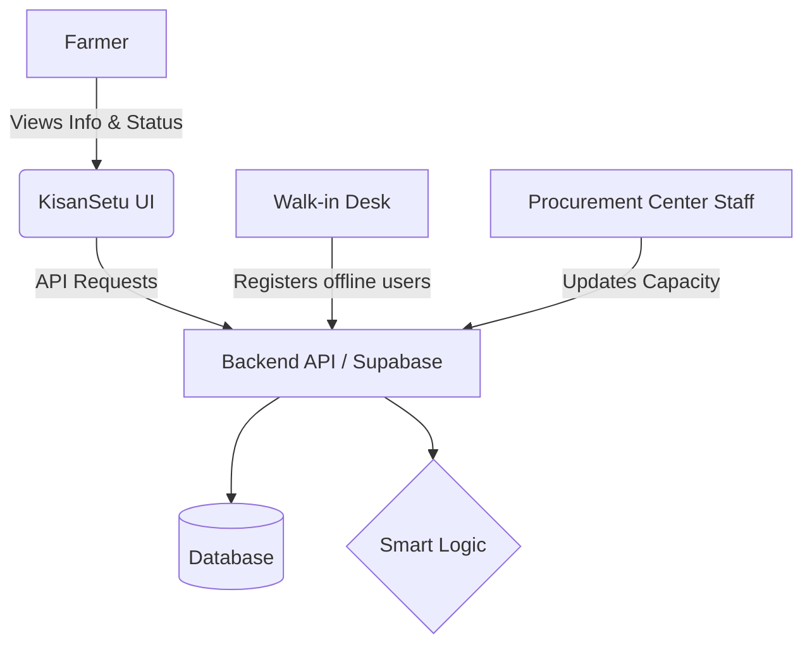
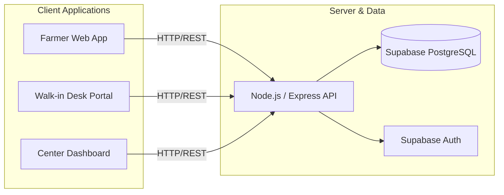
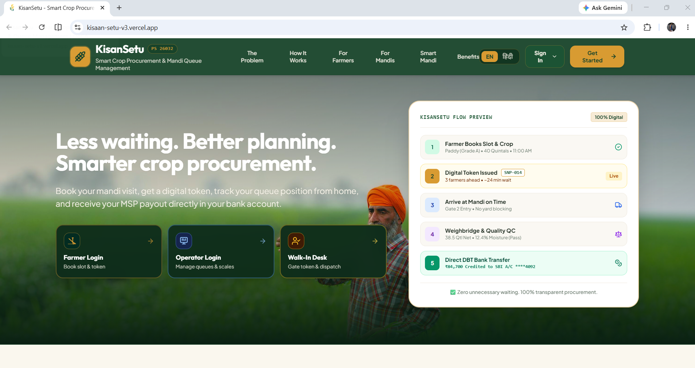

# KisanSetu 🌾

> *Connecting farmers. Reducing congestion. Streamlining procurement.*

A smart procurement-center management platform designed to reduce congestion and improve the crop procurement experience for farmers. Built by **CodeBusters** for **Smart India Hackathon 2026** (Problem Statement: SIH26032).

---

## 📌 The Problem

During crop procurement seasons, farmers often face long waiting times, overcrowded procurement centers, lack of real-time information, and uncertainty about when they should visit a center. Procurement-center staff also face difficulties managing incoming farmers and handling sudden increases in demand during peak periods.

| Key Challenges | Description |
|---|---|
| ⏳ **Long Queues** | Extended waiting times at procurement centers. |
| 🧑‍🤝‍🧑 **Overcrowding** | Centers often exceed capacity during peak harvest times. |
| 🙈 **Poor Visibility** | Farmers lack real-time visibility into current center conditions. |
| 📈 **Sudden Spikes** | Unpredictable surges in farmer arrivals make capacity management difficult. |
| 📵 **Digital Divide** | Limited accessibility for farmers who may not use smartphones. |

---

## 💡 Our Solution

**KisanSetu** connects farmers with procurement centers and provides better visibility into center activity. Instead of farmers simply arriving at a center and waiting in an unpredictable queue, KisanSetu aims to provide them with useful information beforehand so they can make better decisions.

The system also provides tools for procurement-center staff and walk-in desks to manage the flow of farmers more efficiently.

### ✨ Key Features

| Target User | Features Provided |
|---|---|
| 👨‍🌾 **Farmer** | View available centers, check status & expected congestion, simple & accessible UI. |
| 🏢 **Procurement Center** | Monitor incoming farmers, manage activity, track center capacity, update status. |
| 🧑‍💼 **Walk-in Desk** | Register walk-in farmers without smartphones, provide waiting info, assist in process. |

### 🤖 Smart / Automation Features

- Center congestion monitoring
- Intelligent farmer-flow management
- Real-time operational information
- Recommendations based on center conditions

---

## 🧠 What Makes KisanSetu Different?

Existing procurement systems often focus primarily on record keeping and administrative operations. KisanSetu focuses more directly on the movement and experience of farmers around procurement centers.

| Existing Approach | KisanSetu 🌾 |
|---|---|
| Primarily center-focused | Farmer + center focused |
| Limited visibility for farmers | Farmer-facing center information |
| Reactive congestion management | Proactive farmer-flow management |
| Digital-only interaction | Walk-in Desk supports offline users |
| Static information | Dynamic operational information |

---

## 🏗️ System Architecture

### 1. High-Level Flow Architecture


### 2. Component Architecture


---

## 🔄 User Flows

### 👨‍🌾 Farmer Flow
```
Farmer Opens KisanSetu
    ↓
Views procurement centers & checks status
    ↓
Checks expected congestion / waiting
    ↓
Chooses a suitable center/time
    ↓
Visits procurement center
    ↓
Crop Procurement Completed
```

### 🧑‍💼 Walk-in Farmer Flow
```
Farmer without smartphone visits Walk-in Desk
    ↓
Staff enters information & checks availability
    ↓
Provides relevant information to Farmer
    ↓
Farmer proceeds with procurement
```

### 🏢 Procurement Center Flow
```
Procurement Center Updates Activity
    ↓
Backend Processes Information
    ↓
Center Status Updated
    ↓
Farmer / Walk-in Desk Receives Updates
```

---

## 🛠️ Tech Stack

| Technology | Purpose |
|---|---|
| **React** | Frontend UI |
| **Node.js & Express.js** | Backend API layer |
| **Supabase** | Database / Auth / Backend services |
| **Vercel** | Deployment |

---

## 📸 Screenshots / Demo

**Landing Page**


**👨‍🌾 Farmer Dashboard**


**🏢 Procurement Center (Mandi Operator)**


**🧑‍💼 Walk-in Desk**


🌐 **Live Demo:** [https://kisaan-setu-v3.vercel.app](https://kisaan-setu-v3.vercel.app)

---

## 🚀 Getting Started

**Prerequisites:** Node.js, npm, Git.

```bash
# Clone the repository
git clone <repository-url>
cd KisanSetu

# Install dependencies
npm install

# Run Locally
npm run dev
```
*The application will then be available at: `http://localhost:3000`*

---

## 🔮 Future Scope

- 📞 **IVR / SMS** based access for farmers without smartphones.
- 🗣️ **Multilingual Support** for better accessibility.
- 🤖 **ML-based** congestion prediction.
- 📶 **Offline** and low-connectivity support.
- 📊 **Historical analytics** for procurement and congestion.
- 🔗 **Integration** with government procurement data.

---

## 👥 Team CodeBusters

- **Tathagat Aryan** (Team Lead)
- **Sanchit Marwah**
- **Aman Kumar Yadav**
- **Sristi**
- **Shreyansh Kumar**
- **Sanchit Prajapati**

> *This project was developed as a prototype for Smart India Hackathon 2026.*
